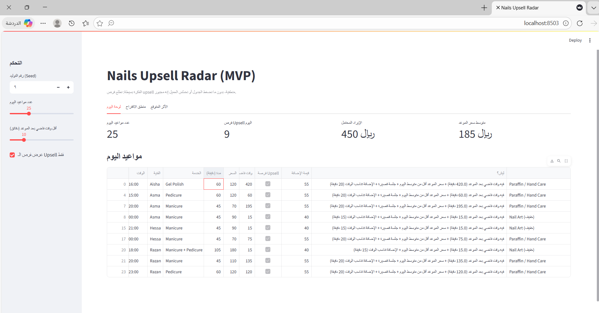

# Nails Upsell Radar (MVP)

هذا المشروع نموذج بسيط هدفه يطلع **فرص upsell منطقية** في مواعيد صالونات الأظافر، بدون ضغط على العميل ولا تخريب جدول العمل.

---

## الفكرة الأساسية
الفكرة إن مو كل موعد مناسب نضيف له خدمة.  
لكن في مواعيد معيّنة **فيها فرصة طبيعية** نزيد فيها قيمة الحجز، خصوصًا إذا فيه وقت فاضي أو الجلسة قصيرة.

---

## المشكلة
في صالونات الأظافر:

- فيه وقت يضيع بين المواعيد بدون استفادة  
- جلسات قصيرة تنتهي بدري  
- فرص upsell تضيع لأن القرار يدوي  
- أحيانًا لو أحد نبه الفنية في الوقت المناسب، كان ممكن تنضاف خدمة بسيطة  

الهدف هنا مو البيع بأي طريقة، لكن **استغلال الوقت الفاضي بشكل ذكي**.

---

## وش يسوي النظام؟
- يولّد بيانات مواعيد تجريبية لليوم  
- يحلل الجدول لكل فنية  
- يحدد المواعيد اللي فيها فرصة upsell  
- يقترح إضافة مناسبة مثل:
  - Nail Art  
  - Gel Upgrade  
  - Express Care  
- يعطي تقدير للإيراد المحتمل من الإضافات  

---

## ليه استخدمت قواعد بدل Machine Learning؟
اخترت أبدأ بقواعد بسيطة بدل ML لأن:

- هذا MVP ونحتاج منطق واضح وسهل الفهم  
- الفنية أو المدير لازم يعرف ليش طلع الاقتراح  
- القواعد أسهل للاختبار والتعديل السريع  

هذا النموذج **بداية**، مو حل نهائي.

---

## منطق الاقتراح
يتم اقتراح upsell بناءً على عوامل مثل:

- وجود وقت فاضي بعد الموعد  
- سعر الموعد أقل من متوسط اليوم  
- مدة الجلسة قصيرة  
- الإضافة تناسب الوقت المتاح  

القيم المستخدمة حاليًا **افتراضات مبدئية** وقابلة للتغيير.

---

## سياسة الاقتراح
- جلسة قصيرة + وقت فاضي → اقتراح إضافة بسيطة  
- وقت فاضي كافي → اختيار إضافة تناسب المدة  
- ما فيه وقت → ما يطلع أي اقتراح  

الهدف إن الاقتراح يكون **طبيعي وما يضغط الجدول**.

---

## Impact (تقديري)
صفحة Impact ما تعطي أرقام دقيقة، لكنها:

- تربط فرص upsell بالأثر المالي  
- تساعد نقارن سيناريوهات مختلفة  
- تجهّزنا لتجارب فعلية (A/B Testing)

---

## أول تجربة حقيقية بسويها
اختبار إضافة واحدة (مثل Nail Art):

- متى تنعرض  
- كم عميل يقبلها  
- هل أثرت على الجدول أو رضا العميل  

وبناءً عليها نعدّل المنطق.

---

## Screenshots

### لوحة اليوم


### الأثر المتوقع


---

## تشغيل المشروع
```bash
pip install streamlit pandas
streamlit run app.py
